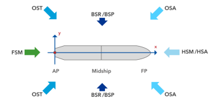
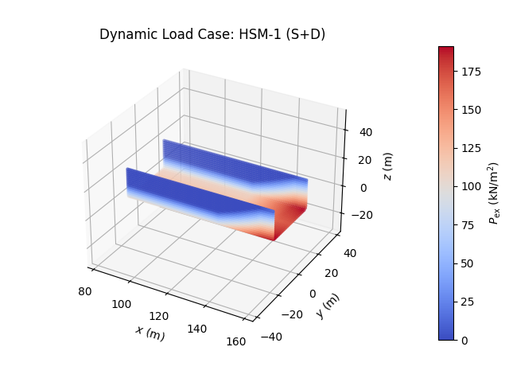

# PRESim: Pressure Simulation Tool

## Overview

PRESim is a specialized program designed for calculating external sea 
pressures $P_{ex}$ on the hull and internal pressures $P_{in}$ on 
the cargo hold of a Bulk Carrier. The calculations are based on 
the **Common Structural Rules (CSR) 2024** and use the concept 
of Equivalent Design Waves (EDWs), **only for strength assessment** 
of the vessel. The resulting pressure distributions can be exported
and imported into Finite Element Analysis (FEA) software such as
ANSYS, ABAQUS, or open-source alternatives.

## Features

- **<ins>External Pressure Calculation:</ins>** Calculates sea 
pressures acting on the hull using the `ExternalSeaPressureCalc` class.
- **<ins>Internal Pressure Calculation:</ins>** Calculates pressures
due to bulk cargo within the cargo hold using the 
`IntCargoPressureCalc` class.

## Equivalent Design Waves (EDWs)

The program incorporates the following EDWs:

- **<ins>HSM-1 & HSM-2:</ins>** Head Sea EDWs to minimize and 
maximize the vertical wave bending moment amidships, respectively.

- **<ins>HSA-1 & HSA-2:</ins>** Head Sea EDWs to maximize and
minimize the head sea vertical acceleration at the forward
perpendicular (FP), respectively.

- **<ins>FSM-1 & FSM-2:</ins>** Following Sea EDWs to minimize and
maximize the vertical wave bending moment amidships, respectively.

- **<ins>BSR-1 & BSR-2:</ins>** Beam Sea EDWs to minimize and
maximize roll motion downward and upward on the port side 
(or starboard side), respectively, with waves from the port 
side (or starboard side).

- **<ins>BSP-1 & BSP-2:</ins>** Beam Sea EDWs to maximize and
minimize the hydrodynamic pressure at the waterline amidships on
the port side (or starboard side), respectively.

- **<ins>OST-1 & OST-2:</ins>** Oblique Sea EDWs to minimize and
maximize the torsional moment at 0.25L from the aft end, with waves
from the port side (or starboard side), respectively.

- **<ins>OSA-1 & OSA-2:</ins>** Oblique Sea EDWs to maximize and
minimize the pitch acceleration, with waves from the port side
(or starboard side), respectively.

<div align="center">
    
</div>

## Installation
1. Clone the repository:
   ```bash
   git clone https://github.com/Lalis98/DynLoadCalc
   ```

2. Navigate to the project directory:
   ```bash
   cd DynLoadCalc
   ```

3. Install required dependencies:
   ```bash
   pip install -r requirements.txt
   ```
   Alternatively, you can install the dependencies individually:

   ```bash
   pip install numpy matplotlib pandas
   ```

## Usage

### Methods Overview

For both classes, the following attributes for methods are used for
`base_case` and `sub_case` calculations:

- For `base_case` of `"HSM"` or`"FSM"` or `"HSA"`:
  - `sub_case="1"`
  - `sub_case="2"`


- For `base_case` of `"BSR"` or`"BSP"` or `"OSA"` or `"OST"`:
  - `sub_case="1P"`
  - `sub_case="2P"`
  - `sub_case="1S"`
  - `sub_case="2S"`

### ExternalSeaPressureCalc

#### Example
Initializes with parameters for external pressure calculation. Example:

```python
from calculations.external_pressure import *
import numpy as np

# Initialize the ExternalSeaPressureCalc class
external_analysis = ExternalSeaPressureCalc(
    coordinates=np.array(       # Coordinates of calculation points (example)
        [0, 0, 0],              # Point 1
    #   ...
        [170.0, 12.0, 1.0]      # Point N
    ),       
    L=218.372,                  # Rule Length (according to CSR) (m)
    B=32.240,                   # Breadth Moulded (m)
    TLC=14.555,                 # Loading Condition Draught (m)
    TSC=14.555,                 # Scantling Draught (m)
    Cb=0.797,                   # Block Coefficient (-)
    Bx_distribution=np.array(   # Distribution of Breadth at waterline relative to x-coordinate
        [[82.27, 158.71],       # x-coordinates along the ship's length (m)
         [32.24, 32.24]]        # Corresponding breadth values at those positions at the waterline (m)
    ),
    kr=0.4 * 32.240,            # Roll Radius of Gyration (m)
    GM=0.2 * 32.240,            # Metacentric height (m)
    bilge_keel=True             # Including Bilge Keel
)

# Calculate the external pressure
ext_pressure = external_analysis.calculate_load_case(
        base_case="HSM",                    # or "FSM", "HSA", "BSP", "BSR", "OST", "OSA"
        sub_case="1",                       # "1", "2": "HSM", "FSM", "HSA",   "1P", "2P", "1S", "2S": "BSP", "BSR", "OST", "OSA"
        fps=1.0,
        load_scenario="Extreme Sea Loads",
        fb=1.05,
        design_load="S+D"
)

# Plot
external_analysis.plot_last_pressure_data(
    color='coolwarm', # Color of colorbar
    size=5,           # Size of Markers
    file_path=None,   # Otherwise set path to save i.e. "C:/Users/user/Downloads/"
    file_name=None,   # Otherwise set name to save i.e. "HSM-1.png"
    show_plot=True    # Show Plot
)

# Save the data into a csv
external_analysis.save_to_csv(
    path="C:/Users/user/Downloads/", 
    file_name="HSM-1.csv",
)

external_analysis.print_data_summary() # Get data of the analysis

```

#### Output

The following is a sample plot generated by running
the above code for the **HSM-1** scenario:

<div align="center">
    
</div>


## Applications

Structural assessment of Bulk Carriers.

Importing pressure distributions into FEA software for further analysis.

## Contribution

Contributions and bug reports are welcome! Please submit issues or pull requests via the project repository.

## License

PRESim is licensed under the MIT License. See the LICENSE file for details.

## Contact

For inquiries or support, contact [michalis.leukioug1@gmail.com]().
