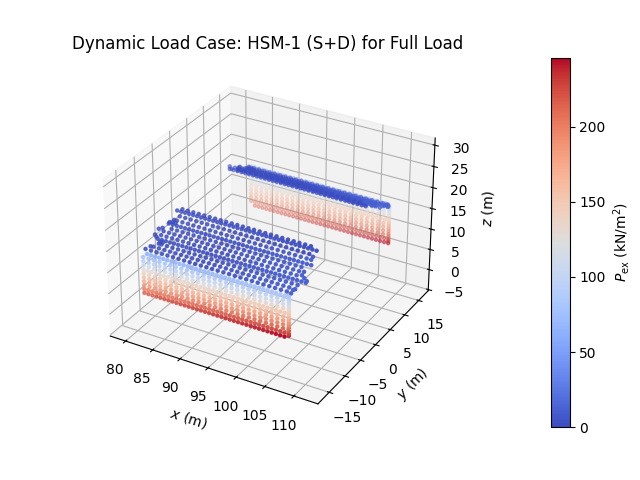

# PRESim: Pressure Simulation Tool

## Overview

PRESim is a specialized program designed for calculating external sea 
pressures $P_{ex}$ on the hull and internal pressures $P_{in}$ on 
the cargo hold of a Bulk Carrier. The calculations are based on 
the **Common Structural Rules (CSR) 2024** and use the concept 
of Equivalent Design Waves (EDWs), **only for strength assessment** 
of the vessel. The resulting pressure distributions can be exported
and imported into Finite Element Analysis (FEA) software such as
ANSYS, ABAQUS, or open-source alternatives.

## Features

- **<ins>External Pressure Calculation:</ins>** Calculates sea 
pressures acting on the hull using the `ExternalSeaPressureCalc` class.
- **<ins>Internal Pressure Calculation:</ins>** Calculates pressures
due to bulk cargo within the cargo hold using the 
`IntCargoPressureCalc` class.

## Equivalent Design Waves (EDWs)

The program incorporates the following EDWs:

- **<ins>HSM-1 & HSM-2:</ins>** Head Sea EDWs to minimize and 
maximize the vertical wave bending moment amidships, respectively.

- **<ins>HSA-1 & HSA-2:</ins>** Head Sea EDWs to maximize and
minimize the head sea vertical acceleration at the forward
perpendicular (FP), respectively.

- **<ins>FSM-1 & FSM-2:</ins>** Following Sea EDWs to minimize and
maximize the vertical wave bending moment amidships, respectively.

- **<ins>BSR-1 & BSR-2:</ins>** Beam Sea EDWs to minimize and
maximize roll motion downward and upward on the port side 
(or starboard side), respectively, with waves from the port 
side (or starboard side).

- **<ins>BSP-1 & BSP-2:</ins>** Beam Sea EDWs to maximize and
minimize the hydrodynamic pressure at the waterline amidships on
the port side (or starboard side), respectively.

- **<ins>OST-1 & OST-2:</ins>** Oblique Sea EDWs to minimize and
maximize the torsional moment at 0.25L from the aft end, with waves
from the port side (or starboard side), respectively.

- **<ins>OSA-1 & OSA-2:</ins>** Oblique Sea EDWs to maximize and
minimize the pitch acceleration, with waves from the port side
(or starboard side), respectively.

<div align="center">
    
</div>

## Installation
1. Clone the repository:
   ```bash
   git clone https://github.com/Lalis98/DynLoadCalc
   ```

2. Navigate to the project directory:
   ```bash
   cd DynLoadCalc
   ```

3. Install required dependencies:
   ```bash
   pip install -r requirements.txt
   ```
   Alternatively, you can install the dependencies individually:

   ```bash
   pip install numpy matplotlib pandas
   ```
## Parameters for Classes and Methods

This section describes the parameters for each class and method in PRESim.

### ExternalSeaPressureCalc

#### Initialization Parameters:

- `coordinates (numpy.ndarray)`: 2D array of calculation points' coordinates `np.array([[x1, y1, z1],..., [xN, yN, zN]])`.
- `L (float)`: Rule Length $L$ $(m)$.
- `B (float)`: Breadth Moulded $B$ $(m)$.
- `TLC (float)`: Loading Condition $T_{LC}$ Draught $(m)$.
- `TSC (float)`: Scantling Draught $T_{SC}$ $(m)$.
- `Cb (float)`: Block Coefficient $C_{B}$ $(-)$.
- `Bx_distribution (numpy.ndarray | float)`: 2D array of x-coordinates and corresponding breadth values at waterline.
- `kr (float)`: Roll Radius of Gyration $k_{r}$ $(m)$.
- `GM (float)`: Metacentric Height $GM$ $(m)$.
- `bilge_keel (bool)`: Whether to include a bilge keel (`True`/`False`).

#### Methods and Parameters:

1. `calculate_load_case`:
Calculates the external pressure load case based on 
different ship scenarios and parameters, and saves in
the class the last pressure results.

    **<ins>Parameters:</ins>**
   - `base_case (str)`: Load case type (e.g.,`"HSM"`, `"FSM"`, `"HSA"`, etc.).
   - `sub_case (str)`: Sub-case (e.g., `"1"`, `"2"`, `"1P"`, etc.).
   - `fps (float)`: Strength assessment factor $f_{ps}$.
   - `load_scenario (str)`: Type of load scenario 
   (e.g.,`"Extreme Sea Loads"`, `"Ballast Water Exchange"`).
   - `fb (float)`: Head correction factor $f_{β}$.

    
2. `plot_last_pressure_data`:Plots the last calculated external pressure data.

    **<ins>Parameters:</ins>**
   - `color (str, optional)`: Color map for the plot 
   (e.g., `'coolwarm'`).
   - `size (int, optional)`: Size of the markers.
   - `file_path (str, optional)`: Path to save the plot. If not specified, the plot is not saved.
   - `file_name (str, optional)`: Name for the saved plot file. If not specified, the default name is used.
   - `show_plot (bool, optional)`: Whether to show the plot.


3. `save_to_csv`: Saves the calculated external pressure data to a CSV file.

    **<ins>Parameters:</ins>**
   - `file_path (str)`: Directory where the CSV file will be saved.
   - `file_name (str)`: Name of the CSV file.


### IntCargoPressureCalc

#### Initialization Parameters:
- `L (float)`: Rule Length $L$ $(m)$.
- `B (float)`: Breadth Moulded $B$ $(m)$.
- `D (float)`: Depth Moulded $D$ $(m)$.
- `TLC (float)`: Loading Condition Draught $T_{LC}$ $(m)$.
- `TSC (float)`: Scantling Draught $T_{SC}$ $(m)$.
- `Cb (float)`: Block Coefficient $C_{B}$ $(-)$.
- `kr (float)`: Roll Radius of Gyration $k_{r}$ $(m)$.
- `GM (float)`: Metacentric Height $GM$ $(m)$.
- `hdb (float)`: Double Hull height $h_{DB}$ $(m)$.
- `cargo_type (str)`: Type of cargo (`"General"`, `"Iron Ore"`, or `"Cement"`).
- `cargo_density (float)`: Cargo Density $ρ_{c}$ $(t/m³)$.
- `cargo_density_effective (float)`: Effective Cargo Density
$ρ_{eff}$ $(t/m³)$.
- `load_scenario (str)`: Load scenario (`"Extreme Sea Loads"`,
`"Water Exchange"`, `"Accidental Flooded"`, `"Harbour / Sheltered Water"`).
- `bilge_keel (bool)`: Whether to include bilge keel (`True`/`False`).

#### Methods and Parameters:
1. `calculate_load_case_full`: Calculates the internal pressure for a given load case with full cargo conditions.

    **<ins>Parameters:</ins>**
   - `base_case (str)`: Load case type (e.g., `"HSM"`, `"FSM"`,
   `"HSA"`, etc.).
   - `sub_case (str)`: Sub-case (e.g., `"1"`, `"2"`, `"1P"`, etc.).
   - `coordinates (numpy.ndarray)`: Coordinates of 
   calculation points `np.array([[x1, y1, z1], ..., [xN, yN, zN]])` $(m)$.
   - `fb (float)`: Head correction factor $f_{β}$.
   - `center_of_gravity (numpy.ndarray)`: Center of gravity
   - coordinates for the cargo hold $(x_G, y_G, z_G)$ $(m)$.
   - `hHPU (float)`: Height $h_{HPU}$ $(m)$.
   - `S0 (float)`: Area $S_0$ $(m^2)$.
   - `Bh (float)`: Breadth of Cargo Hold $B_H$ $(m)$.
   - `Vhc (float)`: Volume of Hatch Coaming $V_{HC}$ $(m^3)$.
   - `lh (float)`: Length of Cargo $l_H$ $(m)$.
   - `angle_alpha (numpy.ndarray)`: Angle distribution $a$ $(deg)$ related to $z$ $(m)$.
   - `shear_load_hopper (bool)`: Include shear load for hopper 
   tank for this geometry (`True`/`False`).
   - `shear_load_inner_bottom (bool)`: Include shear load
   for inner bottom for this geometry (`True`/`False`).
   - `fdc (float)`: Dry Cargo Factor $f_{dc}$.
   - `design_load (str)`: Design load ("S+D", "S", "D").

   **<ins>Return:</ins>**
   - `(np.ndarray)`: The result of the load case calculation .


2. `calculate_load_case_partial`: Calculates the internal 
pressure for a given load case with full cargo conditions.

    **<ins>Parameters:</ins>**

   - `base_case (str)`: Base case identifier (e.g., `"HSM"`, `"FSM"`).
   - `sub_case (str)`: Subcase identifier (e.g., `"1"`, `"1P"`).
   - `coordinates (np.ndarray)`: Array of coordinates representing the geometry $(m)$.
   - `fb (float)`: Heading correction factor $f_β$.
   - `center_of_gravity (np.ndarray)`: Coordinates of the center of 
   gravity $(m)$.
   - `hHPL (float)`: Vertical distance $h_{HPL}$ $(m)$.
   - `Bh (float)`: Breadth of the cargo hold $B_H$ $(m)$.
   - `Bib (float)`: Breadth of the inner bottom $B_{ib}$ $(m)$.
   - `M (float)`: Mass of the bulk cargo $M$ $(t)$.
   - `Vts (float)`: Volume of the lower bulkhead stools $V_{TS}$ $(m^3)$.
   - `lh (float)`: Length of the cargo hold $l_H$ $(m)$.
   - `angle_alpha (numpy.ndarray)`: Angle distribution $a$ $(deg)$ related to $z$ $(m)$.
   - `shear_load_hopper (bool)`: Include shear load 
   for hopper tank for this geometry (`True`/`False`).
   - `shear_load_inner_bottom (bool)`: Include shear load
   for inner bottom for this geometry (`True`/`False`).
   - `design_load (str)`: Load scenario (`"S"`, `"D"`, `"S+D"`). Defaults to `"S+D"`.
   - `fdc (float)`: Dry Cargo factor $f_{dc}$ (default is 1.0).

   **<ins>Return:</ins>**
   - `(np.ndarray)`: The result of the load case calculation .

The result of the load case calculation (np.ndarray).


3. `plot_last_pressure_data`: Plots the last calculated 
internal pressure data.

    **<ins>Parameters:</ins>**

   - `color (str, optional)`: Color map for the plot (e.g., `'coolwarm'`).
   - `size (int, optional)`: Size of the markers.
   - `file_path (str, optional)`: Path to save the plot (if not specified,
   the plot is not saved).
   - `file_name (str, optional)`: Name for the saved plot file (if not specified,
   the plot is not saved).
   - `show_plot (bool, optional)`: Whether to show the plot (`True`/`False`).


4. `save_to_csv`: Saves the calculated internal pressure
data to a CSV file.

    **<ins>Parameters:</ins>**

   - `file_path (str)`: Directory where the CSV file will be saved.
   - `file_name (str)`: Name of the CSV file.


5. `save_all_to_csv`: Saves all the added pressure data of the class
to a CSV file.

    **<ins>Parameters:</ins>**

   - `file_path (str)`: Directory where the CSV file will be saved.
   - `file_name (str)`: Name of the CSV file.


6. `add_pressure_data`: Adds the last calculated 
pressure data to the class, either initializing or 
appending to the existing pressure data array.


7. `clear_all_pressure_data`: Clears all stored 


8. `plot_all_pressure_data`: Plots all the stored pressure data,
with customization options for the appearance of the plot.
pressure data in the class.

    **<ins>Parameters:</ins>**

   - `color (str, optional)`: Color map for the plot (e.g., `'coolwarm'`).
   - `size (int, optional)`: Size of the markers.
   - `file_path (str, optional)`: Path to save the plot (if not specified,
   the plot is not saved).
   - `file_name (str, optional)`: Name for the saved plot file (if not specified,
   the plot is not saved).
   - `show_plot (bool, optional)`: Whether to show the plot (`True`/`False`).
   - `title (str, optional)`: Set the title of the diagram.

### Utility Functions

Utility functions for processing multiple load 
cases and generating pressure diagrams. The following methods
are called in the `main.py`.

1. `process_load_cases_external`:
Processes external load cases by calculating and
visualizing pressure distributions for sea loads.

```python
from utils.utils import *
from calculations.external_pressure import *
import numpy as np

# Initialize the ExternalSeaPressureCalc class
external_analysis = ExternalSeaPressureCalc(
    coordinates=np.array([1.0, 1.0, 1.0]),  # Coordinates of calculation points (example)
    # ...
    bilge_keel=True  # Including Bilge Keel
)

load_cases = [
    ["HSM", "1", 1.0, "Extreme Sea Loads", 1.05, "S+D"],
    # ...
    ["OSA", "2S", 1.0, "Extreme Sea Loads", None, "S+D"],
]

process_load_cases_external(
    external_analysis,
    load_cases,
    file_path=None,
    color='coolwarm',
    size=5,
    show_plot=True
)
```
The following table outlines the structure of a `load_case`:

| Index | 	Field Name      | Example Value         | Description                         |
|-------|------------------|-----------------------|-------------------------------------|
| `[0]` | 	`base_case`     | `"HSM"`               | Base case identifier                |
| `[1]` | 	`sub_case`      | `"1"`                 | Sub-case identifier                 |
| `[2]` | 	`fps`           | `1.0`                 | Factor for Strength Assessment      |
| `[3]` | 	`load_scenario` | `"Extreme Sea Loads"` | Description of the load scenario    |
| `[4]` | 	`design_load`   | `S+D`                 | Load combination (Static / Dynamic) |

2. `process_load_cases_full`:
Automates the processing of full load cases, including calculations and visualization.

```python
from utils.utils import *
from calculations.internal_pressure import *
import numpy as np

coordinates_bulk = np.array(  # Data points of bulkhead geometry
    [1.,2., 3.],
    # ...
    [2.,3., 4.],
)

coordinates_side = np.array(  # Data points of side shell geometry
    [7.,2., 2.],
    # ...
    [8.,3., 4.],
)

cog = np.array([95.62, 0.0, 11.19])     # Center of Gravity of Cargo Hold (x, y, z) (m)
angle_distribution_side = np.array([
    [5.68, 15.20, 90.0],                # 5.68 m < z < 15.20 m, angle is 90.0 deg
    [15.20, 23.90, 147.688]             # 15.20 m < z < 23.90 m, angle is 147.0 deg
])
hHPU = 13.46                            # Height hHPU (m)
S0 = 125.840                            # Area S0 (m²)
Bh = 32.240                             # Breadth of Cargo Hold (m)
Vhc = 360.78                            # Volume of Hatch Coaming (m³)
lh = 25.480                             # Length of Cargo (m)

# Initialize the IntCargoPressureCalc class
internal_analysis = IntCargoPressureCalc(
    L=218.372,
    # ...
    bilge_keel=True
)

# Different Load Cases to run for full loading
load_cases = [
    ["HSM", "1", 1.05],
    # ...
    ["OSA", "2S", 1.0],
]

# Different compartments consisting the geometry
comp_full_load = [
    [coordinates_bulk, cog, hHPU, S0, Bh, Vhc, lh, 90.0, False, False, 1.0, "S+D"],
    # ...
    [coordinates_side, cog, hHPU, S0, Bh, Vhc, lh, angle_distribution_side, False, False, 1.0, "S+D"]
]


process_load_cases_full(
    internal_analysis,
    load_cases,
    comp_full_load,
    show_plot=True,
    file_path=None,
    file_name=None,
    color='coolwarm',
    size=5
)
```

The following table outlines the structure of a `load_case`:

| Index | 	Field Name  | Example Value | Description               |
|-------|--------------|---------------|---------------------------|
| `[0]` | 	`base_case` | `"HSM"`       | Base case identifier      |
| `[1]` | 	`sub_case`  | `"1"`         | Sub-case identifier       |
| `[2]` | 	`fb`        | `1.0`         | Heading Correction Factor |


Additionally, for the `comp_full_load`:


| Index  | 	Field Name                | Example Value                    | Description                                                    |
|--------|----------------------------|----------------------------------|----------------------------------------------------------------|
| `[0]`  | 	`coordinates`             | `np.array([1.0, 0.0, 11.0],...)` | Coordinates of the geometry                                    |
| `[1]`  | 	`centre_of_gravity`       | `np.array([95, 0.0, 12])`        | Center of gravity                                              |
| `[2]`  | 	`hHPU`                    | `13.5`                           | Height of $h_{HPU}$                                            |
| `[3]`  | 	`S0`                      | `120.0`                          | Area $S_{0}$                                                   |
| `[4]`  | 	`Bh`                      | `32.0`                           | Breadth $B_H$                                                  |
| `[5]`  | 	`Vhc`                     | `350.0`                          | Volume $V_{HC}$                                                |
| `[6]`  | 	`lh`                      | `25.0`                           | Length $l_h$                                                   |
| `[7]`  | 	`angle_alpha`             | `90.0`                           | Angle $a$                                                      |
| `[8]`  | 	`shear_load_hopper`       | `True`                           | Include shear load (if geometry is hopper tank or lower stool) |
| `[9]`  | 	`shear_load_inner_bottom` | `False`                          | Include shear load (if geometry is inner bottom)               |
| `[10]` | 	`fdc`                     | `1.0`                            | Dry Cargo factor $f_{dc}$                                      |
| `[11]` | 	`design_load`             | `S+D`                            | Load combination (Static / Dynamic)                            |

The following table describes the structure of load_cases_full_load:

Index	Field Name	Example Value	Description
[0]	coordinates	coordinates_bulk	Coordinates of the geometry.
[1]	cog	cog	Center of gravity.
[2]	hHPU	hHPU	Height of HPU.
[3]	S0	S0	Area S0.
[4]	Bh	Bh	Width or breadth parameter.
[5]	Vhc	Vhc	Volume of hopper compartment.
[6]	lh	lh	Length parameter.
[7]	angle	90.0	Angle of inclination (in degrees).
[8]	geometry_hopper	False	Is this a hopper tank or lower stool geometry?
[9]	geometry_inner	False	Is this an inner bottom geometry?
[10]	fdc	1.0	Factor fdc.
[11]	design_load	"S+D"	Load combination (Static / Dynamic).

## Usage

### Methods Overview

For both classes, the following attributes for methods are used for
`base_case` and `sub_case` calculations:

- For `base_case` of `"HSM"` or`"FSM"` or `"HSA"`:
  - `sub_case="1"`
  - `sub_case="2"`


- For `base_case` of `"BSR"` or`"BSP"` or `"OSA"` or `"OST"`:
  - `sub_case="1P"`
  - `sub_case="2P"`
  - `sub_case="1S"`
  - `sub_case="2S"`

### ExternalSeaPressureCalc

#### Example
Initializes with parameters for external pressure calculation.

```python
from calculations.external_pressure import *
import numpy as np

# Initialize the ExternalSeaPressureCalc class
external_analysis = ExternalSeaPressureCalc(
    coordinates=np.array(  # Coordinates of calculation points (example)
        [0, 0, 0],  # Point 1
        #   ...
        [170.0, 12.0, 1.0]  # Point N
    ),
    L=218.372,  # Rule Length (according to CSR) (m)
    B=32.240,  # Breadth Moulded (m)
    TLC=14.555,  # Loading Condition Draught (m)
    TSC=14.555,  # Scantling Draught (m)
    Cb=0.797,  # Block Coefficient (-)
    Bx_distribution=np.array(  # Distribution of Breadth at waterline relative to x-coordinate
        [[82.27, 158.71],  # x-coordinates along the ship's length (m)
         [32.24, 32.24]]  # Corresponding breadth values at those positions at the waterline (m)
    ),
    kr=0.4 * 32.240,  # Roll Radius of Gyration (m)
    GM=0.2 * 32.240,  # Metacentric height (m)
    bilge_keel=True  # Including Bilge Keel
)

# Calculate the external pressure
ext_pressure = external_analysis.calculate_load_case(
    base_case="HSM",                    # or "FSM", "HSA", "BSP", "BSR", "OST", "OSA"
    sub_case="1",                       # "1", "2", "1P", "2P", "1S", "2S"
    fps=1.0,                            # Strength Assessment factor
    load_scenario="Extreme Sea Loads",  # "Ballast Water Exchange" or "Extreme Sea Loads"
    fb=1.05,                            # Head Correction Factor fβ
    design_load="S+D"                   # Design load ("S+D", "S", "D)"
)

# Plot
external_analysis.plot_last_pressure_data(
    color='coolwarm',  # Color of colorbar
    size=5,  # Size of Markers
    file_path=None,  # Otherwise set path to save i.e. "C:/Users/user/Downloads/"
    file_name=None,  # Otherwise set name to save i.e. "HSM-1.png"
    show_plot=True  # Show Plot
)

# Save the data into a csv
external_analysis.save_to_csv(
    file_path="C:/Users/user/Downloads/",
    file_name="HSM-1.csv"
)

external_analysis.print_data_summary()  # Get data of the analysis

```

#### Output

The following is a sample plot generated by running
the above code for the **HSM-1** scenario:

<div align="center">
    
</div>

### Internal Cargo Pressure Calculation

#### Example
The internal pressure calculation specifically models the effect
of bulk cargo within the cargo hold. It evaluates the static and
dynamic loads imparted on the internal structure, 
adhering to CSR rules for Bulk Carriers.

```python
from calculations.internal_pressure import *
import numpy as np

# Initialize the IntCargoPressureCalc class
internal_analysis = IntCargoPressureCalc(
    L=218.372,                  # Rule Length (according to CSR) (m)
    B=32.240,                   # Breadth Moulded (m)
    D=20.200,                   # Depth Moulded
    TLC=14.555,                 # Loading Condition Draught (m)
    TSC=14.555,                 # Scantling Draught (m)
    Cb=0.797,                   # Block Coefficient (-)
    kr=0.4 * 32.240,            # Roll Radius of Gyration (m)
    GM=0.2 * 32.240,            # Metacentric height (m)
    hdb=1.74,                   # Double Hull height (m)
    cargo_type="General",       # Allowed values are:
                                # 'General', 'Iron Ore', or 'Cement'
    cargo_density=1.535,        # Cargo Density (t/m³)
    cargo_density_effective=1.600,  # Effective Cargo Density (t/m³)
    load_scenario="Extreme Sea Loads",  # Allowed values are:
                                # "Extreme Sea Loads", "Water Exchange",
                                # "Accidental Flooded", "Harbour / Sheltered Water"
    bilge_keel=True             # Including Bilge Keel
)

# Calculate the internal pressure for Full Load
internal_analysis.calculate_load_case_full(
    base_case="HSM",        # or "FSM", "HSA", "BSP", "BSR", "OST", "OSA"
    sub_case="1",           # "1", "2", "1P", "2P", "1S", "2S"
    coordinates=np.array(   # Coordinates of calculation points (example)
        [80.0, 0, 20.0],    # Point 1
        #   ...
        [90.0, 12.0, 1.0]   # Point N
    ),
    fb=1.05,                # Head Correction factor fβ
    center_of_gravity=np.array(  # Center of Gravity of Cargo Hold (x, y, z) (m)
        [95.62, 0.0, 11.19]
    ),
    hHPU=13.46,             # Height hHPU (m)
    S0=125.840,             # Area S0 (m²)
    Bh=32.240,              # Breadth of Cargo Hold (m)
    Vhc=360.78,             # Volume of Hatch Coaming (m³)
    lh=25.480,              # Length of Cargo (m)
    angle_alpha=np.array([  # Angle α distribution related to z
        [5.68, 15.20, 90.0],  # 5.68 m < z < 15.20 m, angle is 90.0 deg
        [15.20, 23.90, 147.688]  # 15.20 m < z < 23.90 m, angle is 147.0 deg
    ]),
    shear_load_hopper=False,  # Geometry of hopper tank or Lower stool? (include Shear Load)
    shear_load_inner_bottom=False,  # Geometry of inner bottom? (include Shear Load)
    fdc=1.0,                # Dry Cargo Factor 
    design_load="S+D"       # Design Load
)

# Plot
internal_analysis.plot_last_pressure_data(
    color='coolwarm',   # Color of colorbar
    size=5,             # Size of Markers
    file_path=None,     # Otherwise set path to save i.e. "C:/Users/user/Downloads/"
    file_name=None,     # Otherwise set name to save i.e. "HSM-1.png"
    show_plot=True      # Show Plot
)

# Save the data into a csv
internal_analysis.save_to_csv(
    file_path="C:/Users/user/Downloads/",
    file_name="HSM-1.csv"
)

internal_analysis.print_data_summary()  # Get data of the analysis

```
#### Output

The following is a sample plot generated by running
the above code for the **HSM-1 Full Load** scenario:

<div align="center">
    
</div>

## Applications

Structural assessment of Bulk Carriers.

Importing pressure distributions into FEA software for further analysis.

## Contribution

Contributions and bug reports are welcome! Please submit issues or pull requests via the project repository.

## License

PRESim is licensed under the MIT License. See the LICENSE file for details.

## Contact

For inquiries or support, contact [michalis.leukioug1@gmail.com]().
